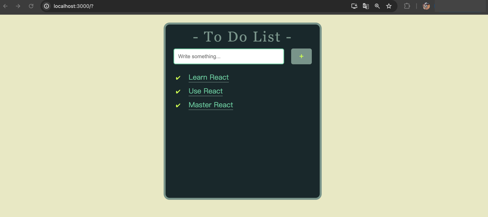

# React Todolist


## What is it?
This is a simple to-do list application built with React. It allows users to add and delete tasks.

## Purpose
The main goal is to practice creating projects with React and to become more familiar with using props. Continuous updates will be made to enhance functionality.

## Installation 

 - Clone the repository to your local machine
```bash
git clone https://github.com/whsiaor/React_ToDoList.git
```
- Navigate to the project directory
 ```bash
 cd /YOUR/PROJECT/FOLDER
 ```

 - Install dependencies
 ```bash
 npm install
 ```

 - Start the application
```bash
npm start
```


